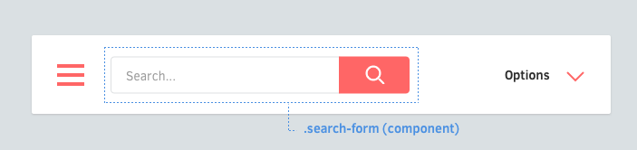

RSCSS
=====

Reasonable System for CSS Stylesheet Structure.

<br>

Introduction
------------

Any CSS greater than 1000 lines will get unwieldy. You'll eventually run into these common pitfalls:

* "What does this class mean?"
* "Is this class still being used?"
* "If I make a new class `green`, will there be a clash?"

**rscss** is an attempt to make sense of all these. It is not a framework. It's simply a set of ideas to guide your process of building maintainable CSS for any modern website or application.

<br>

Components
----------



Think in components. Consider of each piece of your UI as an individual "component."

### Naming components
  Components will be named with **at least two words**, separated by a dash. Examples of a component:

  * A like button (`.like-button`)
  * A search form (`.search-form`)
  * A news article card (`.article-card`)

<br>

## Elements


Elements are things inside your component.

### Naming elements
Each component may have elements. They should have classes that are only **one word**.

  ```scss
  .search-form {
    > .field { /* ... */ }
    > .action { /* ... */ }
  }
  ```

### Element selectors
Prefer to use the `>` child selector whenever possible. This prevents bleeding through nested components, and performs better than descendant selectors.

  ```scss
  .article-card {
    .title     { /* okay */ }
    > .author  { /* ✓ better */ }
  }
  ```

### On multiple words
For those that need two or more words, concatenate them without dashes or underscores.

  ```scss
  .profile-box {
    > .firstname { /* ... */ }
    > .lastname { /* ... */ }
    > .avatar { /* ... */ }
  }
  ```

### Avoid tag selectors
Use classnames whenever possible. Tag selectors are fine, but they may come at a small performance penalty and may not be as descriptive.

  ```scss
  .article-card {
    > h3    { /* ✗ avoid */ }
    > .name { /* ✓ better */ }
  }
  ```

<br>

## Variants


Components may have variants. Elements may have variants, too.

<br>

### Naming variants
Classnames for variants will be prefixed by a dash (`-`).

  ```scss
  .like-button {
    &.-wide { /* ... */ }
    &.-short { /* ... */ }
    &.-disabled { /* ... */ }
  }
  ```

### Element variants
Elements may also have variants.

  ```scss
  .shopping-card {
    > .title { /* ... */ }
    > .title.-small { /* ... */ }
  }
  ```

### Dash prefixes
Dashes are the preferred prefix for variants.

  * It prevents ambiguity with elements.
  * a CSS class can only start with a letter, `_` or `-`.
  * dashes are easier to type than underscores.
  * it kind of resembles switches in UNIX commands (`gcc -O2 -Wall -emit-last`)

<br>

## Nested components


```html
<div class='article-link'>
  <div class='vote-box'>
    ...
  </div>
  <h3 class='title'>...</h3>
  <p class='meta'>...</p>
</div>
```

Sometimes it's necessary to nest components. Here are some guidelines for doing that.

<br>

### Variants of nested components
A component may need to appear a certain way when nested in another component. Avoid modifying the nested component by reaching into it from the containing component.

```scss
.article-header {
  > .vote-box > .up { /* ✗ avoid this */ }
}
```

  Instead, prefer to add a variant to the nested component and apply it from the containing component.

```html
<div class='article-header'>
  <div class='vote-box -highlight'>
    ...
  </div>
  ...
</div>
```

```scss
.vote-box {
  &.-highlight > .up { /* ... */ }
}
```

### Simplifying nested components
Sometimes, when nesting components, your markup can get dirty:

```html
<div class='search-form'>
  <input class='input' type='text'>
  <button class='search-button -red -large'></button>
</div>
```

You can simplify this by using your CSS preprocessor's `@extend` mechanism:

```html
<div class='search-form'>
  <input class='input' type='text'>
  <button class='submit'></button>
</div>
```

```scss
.search-form {
  > .submit {
    @extend .search-button;
    @extend .search-button.-red;
    @extend .search-button.-large;
  }
}
```

<br>

## Layout


### Avoid positioning properties
Components should be made in a way that they're reusable in different contexts. Avoid putting these properties in components:

  * Positioning (`position`, `top`, `left`, `right`, `bottom`)
  * Floats (`float`, `clear`)
  * Margins (`margin`)
  * Dimensions (`width`, `height`) *

### Fixed dimensions
Exception to these would be elements that have fixed width/heights, such as avatars and logos.

### Define positioning in parents
If you need to define these, try to define them in whatever context whey will be in. In this example below, notice that the widths and floats are applied on the *list* component, not the component itself.

  ```css
  .article-list {
    & {
      @include clearfix;
    }

    > .article-card {
      width: 33.3%;
      float: left;
    }
  }

  .article-card {
    & { /* ... */ }
    > .image { /* ... */ }
    > .title { /* ... */ }
    > .category { /* ... */ }
  }
  ```

<br>

## Helpers

```css
._unmargin { margin: 0 !important; }
._center { text-align: center !important; }
._pull-left { float: left !important; }
._pull-right { float: right !important; }
```

For general-purpose classes meant to override values, put them in a separate file and name them beginning with an underscore. They are typically things that are tagged with *!important*. Use them *very* sparingly.

### Naming helpers
Prefix classnames with an underscore. This will make it easy to differentiate them from modifiers defined in the component. Underscores also look a bit ugly which is an intentional side effect: using too many helpers should be discouraged.

  ```html
  <div class='order-graphs -slim _unmargin'>
  </div>
  ```

### Organizing helpers
Place all helpers in one file called `helpers`. While you can separate them into multiple files, it's very preferrable to keep your number of helpers to a minimum.

<br>

CSS structure
-------------

### One component per file
For each component, place them in their own file.

  ```scss
  /* css/components/search-form.scss */
  .search-form {
    > .button { /* ... */ }
    > .field { /* ... */ }
    > .label { /* ... */ }

    // variants
    &.-small { /* ... */ }
    &.-wide { /* ... */ }
  }
  ```

### Use glob matching
In sass-rails and stylus, this makes including all of them easy:

  ```scss
  @import 'components/*';
  ```

### Avoid over-nesting
Use no more than 1 level of nesting. It's easy to get lost with too much nesting.

  ```scss
  /* ✗ Avoid: 3 levels of nesting */
  .image-frame {
    > .description {
      /* ... */

      > .icon {
        /* ... */
      }
    }
  }

  /* ✓ Better: 2 levels */
  .image-frame {
    > .description { /* ... */ }
    > .description > .icon { /* ... */ }
  }
  ```

<br>

Pitfalls
--------

### Bleeding through nested components
Be careful about nested components where the nested component has an element of the same name.

```html
<article class='article-link'>
 <div class='vote-box'>
    <button class='up'></button>
    <button class='down'></button>
    <span class='count'>4</span>
  </div>

  <h3 class='title'>Article title</h3>
  <p class='count'>3 votes</p>
</article>
```

```scss
.article-link {
  > .title { /* ... */ }
  > .count { /* ... (!!!) */ }
}

.vote-box {
  > .up { /* ... */ }
  > .down { /* ... */ }
  > .count { /* ... */ }
}
```

In this case, if `.article-link > .count` did not have the `>` (child) selector, it will also apply to the `.vote-box .count` element. This is one of the reasons why child selectors are preferred.

<br>

Apprehensions
-------------

Some people may have apprehensions to these convention, such as:

* **But dashes suck:**
You're free to omit it and just use regular words, but keep the rest of the ideas in place (components, elements, variants).

* **But I can't think of 2 words:**
Some components will only need one word to express their purpose, such as `alert`. In these cases, consider that using some suffixes will make it clearer that it's a block-level element:

  * `.alert-box`
  * `.alert-card`
  * `.alert-block`

  Or for inlines:

  * `.link-button`
  * `.link-span`

<br>

Other resources
---------------

 * [ITCSS](https://speakerdeck.com/dafed/managing-css-projects-with-itcss#49) ("Inverted Triangle CSS") is a nice complement to any rscss structure.

<br>

Other solutions
---------------

### BEM
[BEM] in nice, but some may be irked at its unconventional syntax. RSCSS pretty much follows BEM conventions, only with a different syntax.

```html
<!-- BEM -->
<form class='site-search site-search--full'>
  <input  class='site-search__field' type='text'>
  <button class='site-search__button'></button>
</form>
```

```html
<!-- rscss -->
<form class='site-search -full'>
  <input  class='field' type='text'>
  <button class='button'></button>
</form>
```

### Terminologies
The same concepts exist in similar ways in other CSS structuring ideologies.

| RSCSS     | BEM      | SMACSS        |
| ---       | ---      | ---           |
| Component | Block    | Module        |
| Element   | Element  | Sub-Component |
| Layout    | ?        | Layout        |
| Variant   | Modifier | Sub-Module & State |

<br>

Summary
-------

* Think in **components**, named with 2 words (`.screenshot-image`)
* Components have **elements**, named with 1 word (`.blog-post .title`)
* Name **variants** with a dash prefix (`.shop-banner.-with-icon`)
* Components can nest
* Remember you can extend to make things simple

[Smacss]: https://smacss.com/
[BEM]: http://bem.info/

[1]: https://developer.mozilla.org/en-US/Web/Guide/CSS/Writing_efficient_CSS#Avoid_the_descendant_selector.21
