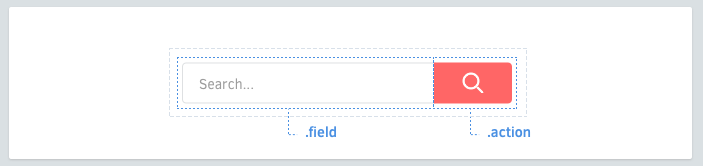

RSCSS
=====

Reasonable standard for CSS stylesheet structure.

This document is as work in progress.

<br>

Problem
-------

Any CSS greater than 1000 lines will get unwieldy. You'll eventually run into these common pitfalls:

* "What does this class mean?"
* "Is this class still being used?"
* "If I make a new class `green`, will there be a clash?"

<br>

Structure
---------

### Think in components


Think of each piece of your UI is an individual "component." Components will be named with **at least two words**, separated by a dash. Examples of a component:

* A like button (`.like-button`)
* A search form (`.search-form`)
* A news article card (`.article-card`)

### Elements



Each component may have elements. They should have classes that are only **one word**.

```scss
.search-form {
  .field { /* ... */ }
  .label { /* ... */ }
}
.article-card {
  .title { /* ... */ }
  .author { /* ... */ }
}
```

If you're going to use elements that don't have class names, make sure that you use the `>` descendant selectors so as to avoid clashes with sub-components.

```scss
.article-card {
  > h3 { /* ... */ }
}
```

### Modifiers


Components may have modifiers. Modifiers will be prefixed by a dash (`-`).

```scss
.like-button {
  &.-wide { /* ... */ }
  *.-short { /* ... */ }
  &.-disabled { /* ... */ }
}
```

Elements may also have modifiers.

```scss
.shopping-card {
  .title { /* ... */ }
  .title.-small { /* ... */ }
}
```

### Nested components

Sometimes it's necessary to nest components.

(to be explained)

### Simplifying nested components

Sometimes, when nesting components, your markup can get dirty:

```html
<div class='search-form'>
  <input type='text' class='input'>
  <button class='search-button -red -large'></button>
</div>
```

You can simplify this by using your CSS preprocessor's `@extend` mechanism:

```html
<div class='search-form'>
  <input type='text' class='input'>
  <button class='submit'></button>
</div>
```

```scss
// sass
.search-form {
  .submit {
    @extend .search-button;
    @extend .search-button.-red;
    @extend .search-button.-large;
  }
}
```

<br>

CSS structure
-------------

### One CSS file per component

```scss
/* css/components/search-form.scss */
.search-form {
  .button { /* ... */ }
  .field { /* ... */ }
  .label { /* ... */ }

  // modifiers
  &.-small { /* ... */ }
  &.-wide { /* ... */ }
}
```

In sass-rails and stylus, this makes including all of them easy:

```scss
@import 'components/*';
```

### Avoid over-nesting

Use no more than 1 level of nesting. It's easy to get lost with too much nesting.

```scss
/* bad */
.image-frame {
  .description {
    /* ... */

    > strong {
      /* ... */
    }
  }
}
```

Consider instead:

```scss
.image-frame {
  .description { /* ... */ }
  .description > strong { /* ... */ }
}
```

<br>

Other solutions
---------------

### BEM

[Bem] in nice but syntax is dirty. However, RSCSS pretty much follows BEM conventions, only with a different syntax.

<br>

Summary
-------

* Think in **components**, named with 2 words (`.screenshot-image`)
* Components have **elements**, named with 1 word (`.blog-post .title`)
* Name **modifiers** with a dash prefix (`.shop-banner.-with-icon`)
* Components can nest
* Remember you can extend to make things simple

[Smacss]: https://smacss.com/
[Bem]: http://bem.info/
