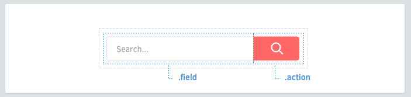

# Elementos

Los elementos son cosas dentro de tus componentes.



## Nombre de los elementos
Cada competente puede tener elements. Estos son clases que tiene solamente **una palabra** en su nombre.

```scss
.search-form {
  > .field { /* ... */ }
  > .action { /* ... */ }
}
```

## Selectores de elementos 
Preferentemente anteponer el selector  `>` cuando es posible. Esto previene conflictos con componentes anidados, y tiene un mejor desempeño que selectores descendientes. 

```scss
.article-card {
  .title     { /* okay */ }
  > .author  { /* ✓ better */ }
}
```

## Multiples palabras 
Para aquellas clases que tienen 2 o más palabras, concatenar las palabras usando guiones.

```scss
.profile-box {
  > .firstname { /* ... */ }
  > .lastname { /* ... */ }
  > .avatar { /* ... */ }
}
```

## Evitar selectores de etiquetas
Usar selectores de clases cuando es posible. Los selectores de etiquetas estan bien, pero pueden reducir un poco el desempeño y no son tan descriptivos.

```scss
.article-card {
  > h3    { /* ✗ avoid */ }
  > .name { /* ✓ better */ }
}
```

No todos los elementos se ven iguales. Las variantes nos ayudarán para esto.
[Continuar →](variants.md)
<!-- {p:.pull-box} -->
